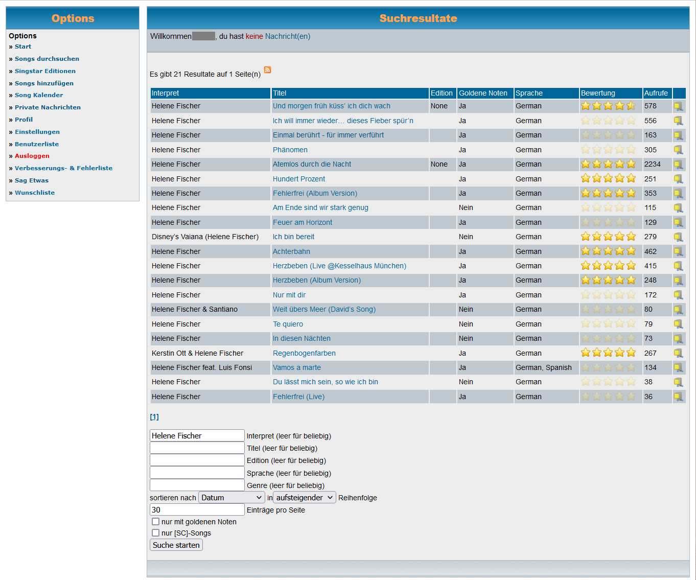

# USDB Plus


<a href="https://addons.mozilla.org/addon/usdb-plus/"></a>

Web browser extension to provided extras to [USDB](https://usdb.animux.de)

with


without



## Features

- highlight specific USDB IDs in search results and detail pages
- dynamic number of USDB ID lists with individual color settings and label
- Sync lists via [Firefox Sync](https://www.mozilla.org/de/firefox/sync/) to use the same configuration on all of your devices.

## Development

using `nodejs == v18.20.7`

``` powershell
npm install --dev
```

Build

``` powershell
pwsh build.ps1
```

Debug in Firefox:

1. Open Firefox
2. Goto `about:debugging`
3. Click __This Firefox__ in left sidenav
4. Click __Load Temporary Add-on__ on the top right
5. Select `./build/firefox/manifest.json`
6. Goto [usdb.animux.de](usdb.animux.de) and try out

Debug in Chrome:

1. Open Google Chrome
2. Goto `chrome://extensions/`
3. enable "Developermode" in top right
4. select "load unpacked Extension"
5. goto `./build/chrome` directory and hit "open"
6. Goto [usdb.animux.de](usdb.animux.de) and try out

Apply changes:

1. change js code in `src` directory
2. re-build `.bundle.js` files by replacing imports with function bodies and recreate the build directories for firefox and chrome

    ``` powershell
    pwsh build.ps1
    ```

3. click __Reload__ button in `about:debugging`

## Links

### Firefox

- [MDN - Browser Extension Docs](https://developer.mozilla.org/en-US/docs/Mozilla/Add-ons/WebExtensions)
- [Firefox Source Docs - about:debugging](https://firefox-source-docs.mozilla.org/devtools-user/about_colon_debugging/index.html)
- [MDN - storage](https://developer.mozilla.org/en-US/docs/Mozilla/Add-ons/WebExtensions/API/storage)
- [MDN - manifest.json](https://developer.mozilla.org/en-US/docs/Mozilla/Add-ons/WebExtensions/manifest.json)
  
  > It is a JSON-formatted file, with one exception: __it is allowed to contain "//"-style comments.__

- [MDN - icons](https://developer.mozilla.org/en-US/docs/Mozilla/Add-ons/WebExtensions/manifest.json/icons)

  > You can use SVG and the browser will scale your icon appropriately. There are currently two caveats though:
  > 1. You need to specify a viewBox in the image. E.g.: `viewBox="0 0 48 48"` [for size `"48"`]
  > 2. Even though you can use one file, you still need to specify various size of the icon in your manifest.

- [MDN - Debugging - Developer tools toolbox](https://extensionworkshop.com/documentation/develop/debugging/#developer-tools-toolbox)
- [MDN - Options page](https://developer.mozilla.org/en-US/docs/Mozilla/Add-ons/WebExtensions/user_interface/Options_pages)

  Note: `console.log()` output on Add-on Preferences pages are __NOT visible__ in the usual debugging console. They __ONLY appear__ in the __developer toolbox console__

- [MDN - Submitting an add-on](https://extensionworkshop.com/documentation/publish/submitting-an-add-on/)

- [Extension Workshop - Developing extensions for Firefox for Android](https://extensionworkshop.com/documentation/develop/developing-extensions-for-firefox-for-android/)

Examples

- [MDN - Your first Extension](https://developer.mozilla.org/en-US/docs/Mozilla/Add-ons/WebExtensions/Your_first_WebExtension)
- [MDN - Your second Extension](https://developer.mozilla.org/en-US/docs/Mozilla/Add-ons/WebExtensions/Your_second_WebExtension)
- [MDN - Implement a settings page](https://developer.mozilla.org/en-US/docs/Mozilla/Add-ons/WebExtensions/Implement_a_settings_page)

### Chrome

- [Chrome - Getting Started with Extensions](https://developer.chrome.com/docs/extensions/get-started?hl=de)
- [Chrome - Publish in Chrome Web Store](https://developer.chrome.com/docs/webstore/publish?hl=de)

Examples

- [Chrome - The hello world Extension](https://developer.chrome.com/docs/extensions/get-started/tutorial/hello-world?hl=de)
- [Chrome - Execute scripts on each page Extension](https://developer.chrome.com/docs/extensions/get-started/tutorial/scripts-on-every-tab?hl=de)
