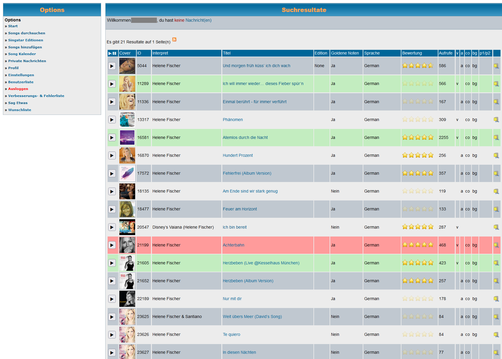

# USDB Plus


<a href="https://addons.mozilla.org/addon/usdb-plus/"></a>
<a href="https://chromewebstore.google.com/detail/usdb-plus/anamejngppfoelibaphlmbaofgcfgcnn
"></a>

Web browser extension to provided extras to [USDB](https://usdb.animux.de)

with



without


## Features

- highlight specific USDB IDs in search results and detail pages
- dynamic number of USDB ID lists with individual color settings and label
- additioal columns in USDB search results:
  - USDB ID and
  - [USDB-Syncer Metatag](https://github.com/bohning/usdb_syncer/wiki/Meta-Tags) columns to search results

## Development

using `nodejs == v18.20.7`

``` powershell
npm install --dev
```

Build

``` powershell
pwsh build.ps1
```

Debug in Firefox:

1. Open Firefox
2. Goto `about:debugging`
3. Click __This Firefox__ in left sidenav
4. Click __Load Temporary Add-on__ on the top right
5. Select `./build/firefox/manifest.json`
6. Goto [usdb.animux.de](usdb.animux.de) and try out

Debug in Chrome:

1. Open Google Chrome
2. Goto `chrome://extensions/`
3. enable "Developermode" in top right
4. select "load unpacked Extension"
5. goto `./build/chrome` directory and hit "open"
6. Goto [usdb.animux.de](usdb.animux.de) and try out

Apply changes:

1. change js code in `src` directory
2. re-build `.bundle.js` files by replacing imports with function bodies and recreate the build directories for firefox and chrome

    ``` powershell
    pwsh build.ps1
    ```

3. click __Reload__ button in `about:debugging`

## Dependencies

- [MDN webextension-polyfill](https://github.com/mozilla/webextension-polyfill/) for cross-browser compatibility from Firefox to Chrome, [v0.12.0](https://unpkg.com/webextension-polyfill@0.12.0/dist/browser-polyfill.js)
